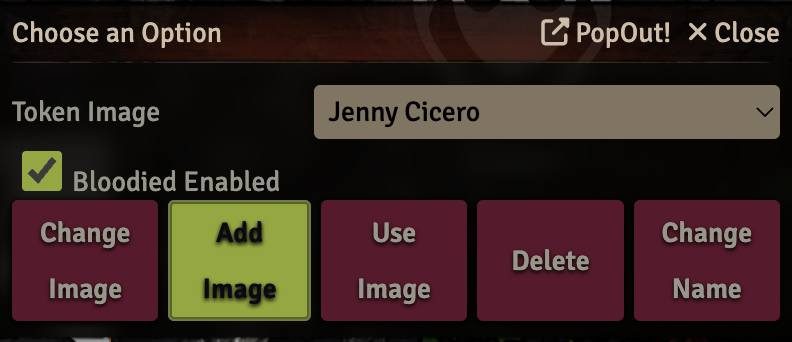

# Switch Token

Switch token allows you to set up tokens that you can easily switch between. 

There is a toggle button that will enable "bloody" behavior. When your HP drops below 50% or above 50% the token will automatically change. 

In order for this to work, you need to make sure one of your tokens has "Bloodied" in its name. Additionally, if you have a token with the name "combat" in it, it will switch to that token in combat. 

# Toggle 
Toggle will switch between the tokens that you have configured with Switch Token.

This will also set the hook to update bloody automatically.

# Enable Bloodied

This will enable the automatic bloody behavior as in toggle, without switching your token. 